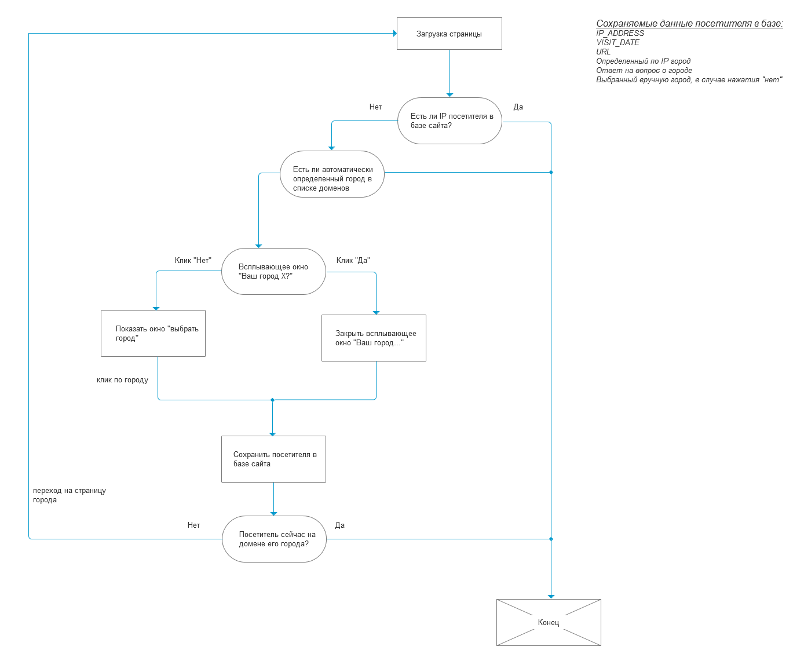
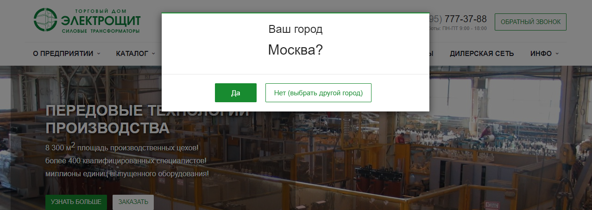
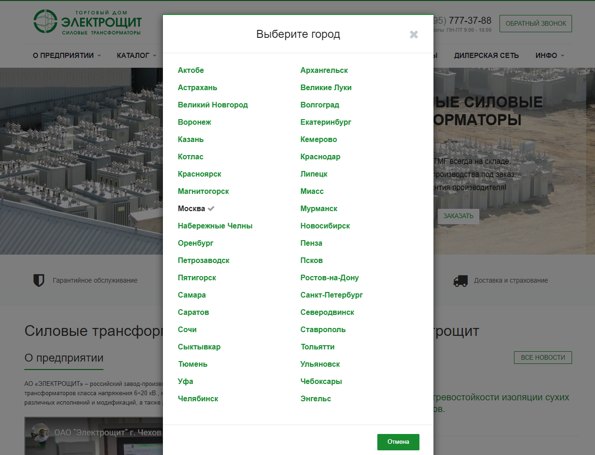

# City Switcher

Переключатель городов (поддоменов) для Bitrix CMS на основе ip-геолокации.
Применяется на transformator.me, nhs.ru.

### Принцип работы кратко

При первом посещении посетителя его ip-адрес сопоставляется с базой `geoip2`. Если у сайта есть поддомен, связанный с этим городом, посетителю задается вопрос о правильности автоопределения. Посетитель либо соглашается с выбором, либо выбирает другой город из списка. Выбор сохраняется в инфоблоке и вопрос больше не задается, пока его ip совпадает с сохраненным ранее значением.

Выбрать любой город из списка вручную возможно в любой момент.

### Принцип работы в виде блок-схемы

## Процесс интеграции на сайт

1. Разместить содержимое репозитория в корень сайта.
2. Создать поддомены в панели управления хостингом или через файловую систему сервера.
3. Создать инфоблок с дополнительным свойством типа строка `PROPERTY_WF_SUBDOMAIN`, которое будет соответствовать наименованию поддоменов 3-го уровня (например, `samara` или `spb`).
4. Заполнить инфоблок элементами в соответствии с добавленными ранее поддоменами.
5. В файле `/include/city-switcher/index.php` указать ID нового инфоблока в константе `SW_CITIES_IBLOCK_ID`.
6. Создать инфоблок (без доп. свойств) для хранения результатов выбора пользователей.
7. Указать ID инфоблока в том же файле в константе `SW_USERS_IBLOCK_ID`.
8. Указать имя поддомена второго уровня, соответствующее корню сайта в константе `SW_ROOT_DOMAIN`.
9. Подключить инклудом файл `/include/city-switcher/index.php` в желаемое место лицевой части сайта.

### Preview

